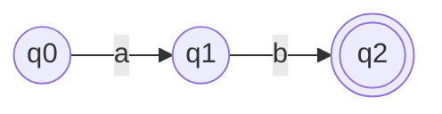
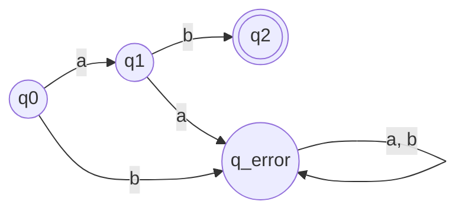
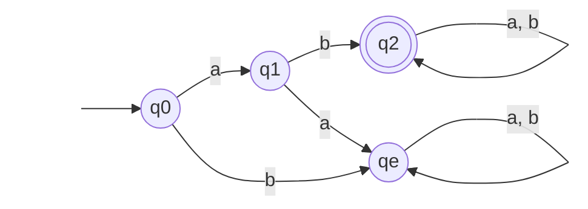
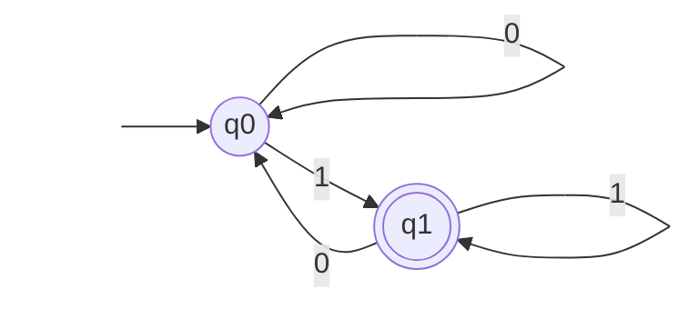
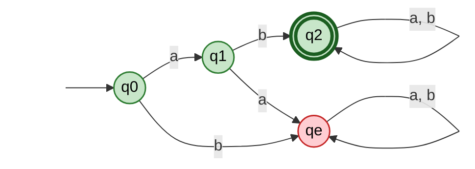
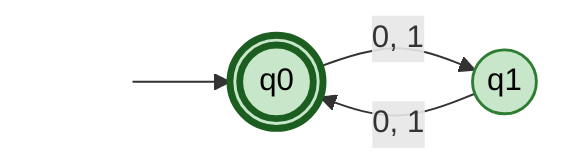
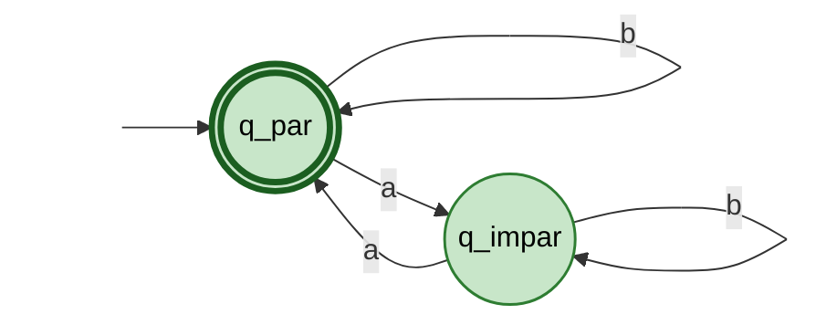
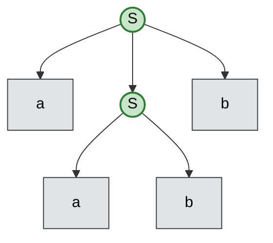

```mermaid
flowchart TD
    %% Título General
    TEORIA["TEORÍA DE LENGUAJES<br/>Conceptos Fundamentales"]

    %% 1. Alfabeto
    TEORIA --> A["1. ALFABETO (Σ)<br/>Conjunto finito y no vacío de símbolos"]
    A --> A_EX["Ejemplos:<br/>• Σ = {a, b}<br/>• Σ = {0, 1}"]

    %% 2. Símbolo
    A -->|"Elemento individual"| S["2. SÍMBOLO<br/>Elemento a ∈ Σ"]

    %% 3. Cadena
    A -->|"Secuencia finita"| C["3. CADENA (w)<br/>Secuencia de símbolos"]
    C --> C_LEN["Longitud |w|<br/>Cantidad de símbolos<br/>Ej: w = abba ➔ |w| = 4"]

    %% 4. Cadena Vacía
    C -->|"Caso especial"| EV["4. CADENA VACÍA (ε)<br/>Cadena sin símbolos<br/>• |ε| = 0<br/>• ε ≠ ∅"]

    %% 5. Lenguaje
    C -->|"Conjunto de cadenas"| L["5. LENGUAJE (L)<br/>Conjunto de cadenas de Σ<br/>Ej: L = {a, ab, abba}"]

    %% Operaciones
    C -->|"Operaciones"| OPS["Conjuntos de Cadenas Finitas"]

    OPS --> K["6. CLAUSURA DE KLEENE (Σ*)<br/>Cadenas posibles infinitas<br/>Incluye ε"]
    K --> K_EX["Σ* = {ε, a, b, aa, ab, ...}"]

    OPS --> KP["7. CLAUSURA POSITIVA (Σ⁺)<br/>Cadenas no vacías<br/>NO incluye ε"]
    KP --> KP_EX["Σ⁺ = {a, b, aa, ab, ...}"]

    %% Relación entre Clausuras
    K <-->|"Σ* = {ε} ∪ Σ⁺"| KP

    %% Estilos de color para Obsidian
    style TEORIA fill:#1e293b,stroke:#94a3b8,stroke-width:2px,color:#fff
    style A fill:#1e3a8a,stroke:#60a5fa,color:#fff
    style A_EX fill:#0f172a,stroke:#475569,color:#cbd5e1
    style S fill:#1d4ed8,stroke:#93c5fd,color:#fff
    style C fill:#2563eb,stroke:#bfdbfe,color:#fff
    style C_LEN fill:#1e40af,stroke:#93c5fd,color:#fff
    style EV fill:#991b1b,stroke:#fca5a5,color:#fff
    style L fill:#166534,stroke:#86efac,color:#fff
    style OPS fill:#334155,stroke:#94a3b8,color:#fff
    style K fill:#4338ca,stroke:#a5b4fc,color:#fff
    style K_EX fill:#0f172a,stroke:#475569,color:#cbd5e1
    style KP fill:#3730a3,stroke:#a5b4fc,color:#fff
    style KP_EX fill:#0f172a,stroke:#475569,color:#cbd5e1
```

> [!important] Cadena Vacía (ε)
> * **Sí es una cadena:** Tiene longitud 0 ($|\varepsilon| = 0$).
> * **No confundir con el conjunto vacío ($\varnothing$):** La cadena vacía es un elemento (palabra); el conjunto vacío es una colección sin elementos.

> [!warning] Regla de Pertenencia a $\Sigma^*$
> Una cadena pertenece a $\Sigma^*$ si y solo si **todos** sus símbolos forman parte del alfabeto $\Sigma$.
> * *Ejemplo:* Si $\Sigma = \{a, b\}$, la cadena `abc` **NO** pertenece a $\Sigma^*$ porque el símbolo `c` no está en el alfabeto.

> [!note] Concepto Clave: Símbolo vs. Cadena
> * **Símbolo:** Elemento individual de un alfabeto ($a \in \Sigma$).
> * **Cadena:** Secuencia de símbolos. Aunque la letra $a$ puede verse como una cadena de longitud 1, conceptualmente nace como un símbolo del alfabeto.

> [!tip] Resumen de Diferencias: $\Sigma^*$ vs. $\Sigma^+$
> * **$\Sigma^{*}$ (Clausura de Kleene):** Incluye la cadena vacía ($\varepsilon \in \Sigma^*$).
> * **$\Sigma^{+}$ (Clausura Positiva):** **NO** incluye la cadena vacía ($\varepsilon \notin \Sigma^+$).
> * **Relación:** $\Sigma^* = \{\varepsilon\} \cup \Sigma^+$


| **Operación**     | **Símbolo / Notación** | **Definición**                                                         | **Aplicando L1​={a,ab,b} y L2​={b,ba}** | **Clave para examen**                                                     |
| ----------------- | ---------------------- | ---------------------------------------------------------------------- | --------------------------------------- | ------------------------------------------------------------------------- |
| **Unión**         | $L_1 \cup L_2$         | Cadenas que pertenecen a $L_1$, a $L_2$ o a ambos.                     | $\{a, ab, b, ba\}$                      | Juntar elementos **sin duplicar** los repetidos (ej. la $b$).             |
| **Intersección**  | $L_1 \cap L_2$         | Cadenas que pertenecen **simultáneamente** a $L_1$ y $L_2$.            | $\{b\}$                                 | Buscar únicamente los elementos **comunes** en ambos conjuntos.           |
| **Concatenación** | $L_1 L_2$              | Combinar **cada cadena** de $L_1$ seguida de **cada cadena** de $L_2$. | $\{ab, aba, abb, abba, bb, bba\}$       | El orden importa: se toma un elemento de $L_1$ y se le pega uno de $L_2$. |
> Para formar el conjunto resultante, se une cada elemento respetando la posición:
> * Tomando `a` de $L_1 \rightarrow$ `ab`, `aba`
> * Tomando `ab` de $L_1 \rightarrow$ `abb`, `abba`
> * Tomando `b` de $L_1 \rightarrow$ `bb`, `bba`


# Expresiones Regulares (Regex) en Teoría de Lenguajes

Una **Expresión Regular (ER)** es una representación algebraica y compacta que define un **lenguaje formal** (conjunto de cadenas). Sirven para que los analizadores léxicos reconozcan patrones como identificadores, números o palabras clave.

---

## 1. Operadores y Conceptos Fundamentales

### Operadores Básicos


* **Clausura de Kleene ($a^*$):** Acepta **0 o más** repeticiones de $a$ (incluye $\varepsilon$).
* **Clausura Positiva ($a^+$):** Acepta **1 o más** repeticiones de $a$ ($a^+ = aa^*$).
* **Opcionalidad ($a?$):** Indica que $a$ puede aparecer **0 o 1 vez** (es equivalente a $(a | \varepsilon)$).

### Agrupación y Precedencia

Los paréntesis `()` se utilizan para **agrupar** subexpresiones y modificar la prioridad de evaluación.

> [!important] Precedencia de Operadores (De mayor a menor prioridad)
> 1. **Paréntesis y Clausuras:** `()`, `*`, `+`, `?` (Tienen la máxima prioridad).
> 2. **Concatenación:** `ab` (Se evalúa antes que la unión).
> 3. **Unión / Alternancia:** `|` o `+` (Tiene la prioridad más baja).

* **Ejemplo de Precedencia:**
  * `ab*` representa: la letra $a$ seguida de **cero o más** letras $b$ $\rightarrow \{a, ab, abb, abbb, \dots\}$.
  * `(ab)*` representa: la secuencia $ab$ repetida **cero o más** veces $\rightarrow \{\varepsilon, ab, abab, ababab, \dots\}$.

---

## 2. Definiciones Regulares Típicas para Compiladores

Para simplificar las expresiones, se definen conjuntos base utilizando abreviaciones:

* $\text{letra} = [a-zA-Z]$
* $\text{dígito} = [0-9]$

---

## 3. Patrones Léxicos Comunes

| Token / Concepto | Expresión Regular | Cadenas Aceptadas | Cadenas NO Aceptadas |
| :--- | :--- | :--- | :--- |
| **1. Identificadores** | $\text{letra}(\text{letra} \mid \text{dígito})^*$ | `x`, `suma`, `var1`, `contador_1` | `1var` (empieza con número), `var-1` |
| **2. Números Enteros** | $\text{dígito}^+$ | `0`, `12`, `4096` | `""` (cadena vacía), `12.5` |
| **3. Números Decimales** | $\text{dígito}^+\,.\,\text{dígito}^+$ | `3.1416`, `0.5`, `100.0` | `.5` (falta entero), `12.` (falta decimal) |
| **4. Op. Aritméticos** | `+` $\mid$ `-` $\mid$ `*` $\mid$ `/` | `+`, `-`, `*`, `/` | `++`, `**` |
| **5. Op. Relacionales**| `<` $\mid$ `>` $\mid$ `<=` $\mid$ `>=` $\mid$ `==` $\mid$ `!=` | `<`, `>=`, `==`, `!=` | `=`, `!`, `<>` |

---

## 4. Guía Rápida para Evaluación en Exámenes

> [!tip] ¿Cómo saber qué acepta y qué rechaza una Expresión Regular?
> 1. **Identifica los elementos obligatorios:** Todo lo que no tenga `*`, `?` o `|` debe aparecer exactamente en esa posición.
> 2. **Evalúa los componentes opcionales (`?` / `*`):** Sustitúyelos mentalmente por $\varepsilon$ (nada) para ver cuál es la cadena más corta posible que acepta el patrón.
> 3. **Revisa las uniones (`|`):** Toma un solo camino de las opciones encerradas entre paréntesis o separadas por la barra horizontal.

> [!warning] Error Común
> Confundir `dígito*` con `dígito^+`. Si un número entero se define como `dígito*`, aceptará la cadena vacía $\varepsilon$, lo cual suele ser un error en lenguajes de programación.


# Autómata Finito Determinista (AFD)

Un **Autómata Finito Determinista (AFD)** es un modelo matemático de computación que reconoce lenguajes regulares. Recibe una cadena de entrada de manera secuencial y, comenzando en un estado inicial, cambia de estado según cada símbolo leído. 

Formalmente se define como una **tupla de 5 elementos (quíntupla)**:

$$M = (Q, \Sigma, \delta, q_0, F)$$

---

## Componentes Formales

### 1. Conjunto Finito de Estados ($Q$)
* **Definición:** Es un conjunto finito y no vacío que contiene todos los estados posibles en los que puede estar el autómata durante su ejecución.
* **Notación:** $Q = \{q_0, q_1, q_2, \dots, q_n\}$
* **Ejemplo:** En un torniquete de acceso, $Q = \{\text{Bloqueado}, \text{Desbloqueado}\}$.

### 2. Alfabeto de Entrada ($\Sigma$)
* **Definición:** Es un conjunto finito y no vacío de símbolos que el autómata puede leer como entradas válidas.
* **Notación:** $\Sigma = \{a, b\}$ o $\Sigma = \{0, 1\}$
* **Regla:** El autómata solo procesa cadenas formadas exclusivamente por símbolos pertenecientes a $\Sigma$.

### 3. Función de Transición ($\delta$)
* **Definición:** Es el "cerebro" o mapa de reglas del autómata. Dicta a qué estado debe mover el sistema dado el estado actual y el símbolo recién leído.
* **Definición matemática:** 
  $$\delta: Q \times \Sigma \rightarrow Q$$
  *(Recibe un estado de $Q$ y un símbolo de $\Sigma$, y devuelve un único nuevo estado de $Q$).*
* **Determinismo:** Es **determinista** porque para cada par $(\text{estado}, \text{símbolo})$ existe **una sola transición posible**. No hay ambigüedad ni saltos con la cadena vacía ($\varepsilon$).

### 4. Estado Inicial ($q_0$)
* **Definición:** Es el estado específico del conjunto $Q$ en el cual el autómata inicia el procesamiento de cualquier cadena.
* **Restricción formal:** $q_0 \in Q$ (Debe pertenecer a $Q$ y es **único**).

### 5. Conjunto de Estados Finales o de Aceptación ($F$)
* **Definición:** Es un subconjunto de $Q$ que contiene los estados exitosos. Si al terminar de leer toda la cadena de entrada el autómata se encuentra en alguno de estos estados, la cadena es **aceptada**; de lo contrario, es **rechazada**.
* **Restricción formal:** $F \subseteq Q$ (Puede ser un conjunto con un solo estado, varios estados, o incluso el conjunto vacío $\varnothing$).

| Símbolo | Nombre | Tipo de Objeto | Función |
| :---: | :--- | :--- | :--- |
| **$Q$** | Conjunto de estados | Conjunto | Define todos los estados posibles del sistema. |
| **$\Sigma$** | Alfabeto | Conjunto de símbolos | Define las entradas válidas que puede leer. |
| **$\delta$** | Función de transición | Función ($Q \times \Sigma \to Q$) | Regla de movimiento entre estados. |
| **$q_0$** | Estado inicial | Elemento ($q_0 \in Q$) | Punto de arranque único del proceso. |
| **$F$** | Estados finales | Subconjunto ($F \subseteq Q$) | Determina si la cadena es aceptada o no. |

> [!tip] Criterio de Aceptación
> Una cadena $w = a_1 a_2 \dots a_n$ es **aceptada** por $M$ si existe una secuencia de estados $r_0, r_1, \dots, r_n$ en $Q$ tal que:
> 1. $r_0 = q_0$ (Empieza en el estado inicial).
> 2. $r_{i+1} = \delta(r_i, a_{i+1})$ para todo $i = 0, \dots, n-1$ (Sigue las reglas de transición).
> 3. $r_n \in F$ (El estado final donde termina pertenece a $F$).


# Guía Paso a Paso para Construir un AFD

Para diseñar un Autómata Finito Determinista (AFD) a partir de un problema o lenguaje dado, se sigue una metodología sistemática de 4 pasos.

---

## Metodología de Construcción

1. **Definir el Alfabeto ($\Sigma$):** Identificar qué símbolos procesará el autómata.
2. **Identificar la Cadena Mínima (Camino Feliz):** Trazar los estados estrictamente necesarios para aceptar la palabra más corta posible del lenguaje.
3. **Completar las Transiciones (Determinismo):** Asegurarse de que **cada estado** tenga **exactamente una salida** para cada símbolo de $\Sigma$.
4. **Agregar Estados de Trampa (si aplica):** Si la entrada viola las reglas del lenguaje, enviarla a un estado de rechazo del cual no se pueda salir.

---

## Ejemplo Práctico

**Problema:** Construir un AFD que acepte cadenas del alfabeto $\Sigma = \{a, b\}$ que **comiencen con la secuencia `ab`**.

### Paso 1: Cadena mínima
La cadena más corta válida es `ab`. Necesitamos 3 estados:
* `q0`: Estado inicial (espera la `a`).
* `q1`: Ha leído `a` (espera la `b`).
* `q2`: Ha leído `ab` (Estado final de aceptación).




### Paso 2: Manejo de errores y trampas (Violación del prefijo)

- Si estando en `q0` leemos una `b` (la cadena empieza mal), pasamos a un estado de trampa `q_error`.
    
- Si estando en `q1` leemos una `a` (teníamos `a` y sigue otra `a`), también se rompe la regla y vamos a `q_error`.

### Paso 3: Completar el autómata (Comportamiento tras la aceptación)

Una vez alcanzado `q2` (ya se cumplió que inicia con `ab`), cualquier símbolo posterior ($a$ o $b$) mantiene la cadena como válida. Por lo tanto, `q2` transiciona sobre sí mismo.




### ¿Cómo se formula una Tabla de Transiciones?

Una tabla de transición es la representación tabular de la función $\delta: Q \times \Sigma \rightarrow Q$. Para estructurarla correctamente:

- **Filas:** Representan los estados del autómata ($Q$).
    
- **Columnas:** Representan los símbolos del alfabeto ($\Sigma$).
    
- **Simbología de control:**
    
    - **Flecha ($\rightarrow$):** Señala el **estado inicial** ($q_0$).
        
    - **Asterisco ($*$):** Identifica los **estados finales o de aceptación** ($F$).
        
- **Celdas:** Contienen el estado destino al que se mueve el autómata al estar en el estado de la fila y leer el símbolo de la columna.
    

###  ¿Cómo se prueba manualmente una cadena en un AFD?

Probar una cadena $w = a_1 a_2 \dots a_n$ consiste en hacer el seguimiento paso a paso del estado actual:

1. **Inicio:** Comienzas siempre en el estado inicial $q_0$.
    
2. **Lectura:** Leees el primer símbolo de la cadena y sigues la transición correspondiente en la tabla/diagrama para pasar al nuevo estado.
    
3. **Iteración:** Repites el proceso con cada símbolo de izquierda a derecha.
    
4. **Evaluación:** Al consumir el último símbolo:
    
    - Si el estado final pertenece a $F$ ($*$), la cadena es **Aceptada**.
        
    - Si el estado final NO pertenece a $F$, la cadena es **Rechazada**.

|**Estado**|**0**|**1**|
|---|---|---|
|**$\rightarrow q_0$**|$q_0$|$q_1$|
|**$*q_1$**|$q_0$|$q_1$|




#### B. Prueba Manual de 3 Cadenas

- **Cadena 1: `011`**
    
    1. Inicio en $q_0$.
        
    2. Lee `0`: $\delta(q_0, 0) = q_0$
        
    3. Lee `1`: $\delta(q_0, 1) = q_1$
        
    4. Lee `1`: $\delta(q_1, 1) = q_1$
        
    
    - **Resultado:** Termina en $q_1 \in F$ $\rightarrow$ **ACEPTADA**
        
- **Cadena 2: `10`**
    
    1. Inicio en $q_0$.
        
    2. Lee `1`: $\delta(q_0, 1) = q_1$
        
    3. Lee `0`: $\delta(q_1, 0) = q_0$
        
    
    - **Resultado:** Termina en $q_0 \notin F$ $\rightarrow$ **RECHAZADA**
        
- **Cadena 3: `000`**
    
    1. Inicio en $q_0$.
        
    2. Lee `0`: $\delta(q_0, 0) = q_0$
        
    3. Lee `0`: $\delta(q_0, 0) = q_0$
        
    4. Lee `0`: $\delta(q_0, 0) = q_0$
        
    
    - **Resultado:** Termina en $q_0 \notin F$ $\rightarrow$ **RECHAZADA**


# Ejercicios Resueltos de Autómatas Finitos Deterministas (AFD)

---

## Ejercicio 1: Reconocimiento de Prefijo Específico

**Problema:** Diseñar un AFD sobre el alfabeto $\Sigma = \{a, b\}$ que acepte todas las cadenas que **comiencen con la secuencia `ab`**.

### 1. Definición Formal
$$M = (Q, \Sigma, \delta, q_0, F)$$

* $Q = \{q_0, q_1, q_2, q_{\text{e}}\}$
* $\Sigma = \{a, b\}$
* Estado inicial = $q_0$
* $F = \{q_2\}$

---

### 2. Diagrama del AFD




|**Estado**|**a**|**b**|
|---|---|---|
|**$\rightarrow q_0$**|$q_1$|$q_{\text{e}}$|
|**$q_1$**|$q_{\text{e}}$|$q_2$|
|**$*q_2$**|$q_2$|$q_2$|
|**$q_{\text{e}}$**|$q_{\text{e}}$|$q_{\text{e}}$|

### 4. Pruebas de Cadenas

#### Cadenas Válidas (Pertenecen a $L$)

1. **`ab`**: $\delta(q_0, a) = q_1 \rightarrow \delta(q_1, b) = q_2 \in F$ $\rightarrow$ **Aceptada**
    
2. **`abaa`**: $\delta(q_0, a) = q_1 \rightarrow \delta(q_1, b) = q_2 \rightarrow \delta(q_2, a) = q_2 \rightarrow \delta(q_2, a) = q_2 \in F$ $\rightarrow$ **Aceptada**
    
3. **`abbb`**: $\delta(q_0, a) = q_1 \rightarrow \delta(q_1, b) = q_2 \rightarrow \delta(q_2, b) = q_2 \rightarrow \delta(q_2, b) = q_2 \in F$ $\rightarrow$ **Aceptada**
    

#### Cadenas Inválidas (No pertenecen a $L$)

1. **`ba`**: $\delta(q_0, b) = q_{\text{e}} \rightarrow \delta(q_{\text{e}}, a) = q_{\text{e}} \notin F$ $\rightarrow$ **Rechazada**
    
2. **`a`**: $\delta(q_0, a) = q_1 \notin F$ $\rightarrow$ **Rechazada**
    
3. **`aab`**: $\delta(q_0, a) = q_1 \rightarrow \delta(q_1, a) = q_{\text{e}} \rightarrow \delta(q_{\text{e}}, b) = q_{\text{e}} \notin F$ $\rightarrow$ **Rechazada**


## Ejercicio 2: Verificación de Paridad (Longitud Par)

**Problema:** Diseñar un AFD sobre el alfabeto $\Sigma = \{0, 1\}$ que acepte únicamente cadenas de **longitud par** (incluyendo la cadena vacía $\varepsilon$).

### 1. Definición Formal

$$M = (Q, \Sigma, \delta, q_0, F)$$

- $Q = \{q_0, q_1\}$
    
- $\Sigma = \{0, 1\}$
    
- Estado inicial = $q_0$
    
- $F = \{q_0\}$





|**Estado**|**0**|**1**|
|---|---|---|
|**$\rightarrow *q_0$**|$q_1$|$q_1$|
|**$q_1$**|$q_0$|$q_0$|


### 4. Pruebas de Cadenas

#### Cadenas Válidas (Pertenecen a $L$)

1. **$\varepsilon$ (Cadena vacía)**: El autómata inicia y termina en $q_0 \in F$ sin procesar símbolos $\rightarrow$ **Aceptada**
    
2. **`01`**: $\delta(q_0, 0) = q_1 \rightarrow \delta(q_1, 1) = q_0 \in F$ $\rightarrow$ **Aceptada**
    
3. **`1100`**: $\delta(q_0, 1) = q_1 \rightarrow \delta(q_1, 1) = q_0 \rightarrow \delta(q_0, 0) = q_1 \rightarrow \delta(q_1, 0) = q_0 \in F$ $\rightarrow$ **Aceptada**
    

#### Cadenas Inválidas (No pertenecen a $L$)

1. **`0`**: $\delta(q_0, 0) = q_1 \notin F$ $\rightarrow$ **Rechazada**
    
2. **`101`**: $\delta(q_0, 1) = q_1 \rightarrow \delta(q_1, 0) = q_0 \rightarrow \delta(q_0, 1) = q_1 \notin F$ $\rightarrow$ **Rechazada**
    
3. **`00000`**: $\delta(q_0, 0) = q_1 \rightarrow \delta(q_1, 0) = q_0 \rightarrow \delta(q_0, 0) = q_1 \rightarrow \delta(q_1, 0) = q_0 \rightarrow \delta(q_0, 0) = q_1 \notin F$ $\rightarrow$ **Rechazada**
    

## Ejercicio 3: Conteo de Símbolos (Número Par de `a`s)

**Problema:** Diseñar un AFD sobre el alfabeto $\Sigma = \{a, b\}$ que acepte cadenas que contengan un **número par de letras `a`** (el número de `b`s no afecta la aceptación).

### 1. Definición Formal

$$M = (Q, \Sigma, \delta, q_0, F)$$

- $Q = \{q_{\text{par}}, q_{\text{impar}}\}$
    
- $\Sigma = \{a, b\}$
    
- Estado inicial = $q_{\text{par}}$
    
- $F = \{q_{\text{par}}\}$
    

### 2. Diagrama del AFD




|**Estado**|**a**|**b**|
|---|---|---|
|**$\rightarrow *q_{\text{par}}$**|$q_{\text{impar}}$|$q_{\text{par}}$|
|**$q_{\text{impar}}$**|$q_{\text{par}}$|$q_{\text{impar}}$|
### 4. Pruebas de Cadenas

#### Cadenas Válidas (Pertenecen a $L$)

1. **`bb`**: $\delta(q_{\text{par}}, b) = q_{\text{par}} \rightarrow \delta(q_{\text{par}}, b) = q_{\text{par}} \in F$ $\rightarrow$ **Aceptada** (0 es número par)
    
2. **`aba`**: $\delta(q_{\text{par}}, a) = q_{\text{impar}} \rightarrow \delta(q_{\text{impar}}, b) = q_{\text{impar}} \rightarrow \delta(q_{\text{impar}}, a) = q_{\text{par}} \in F$ $\rightarrow$ **Aceptada**
    
3. **`baab`**: $\delta(q_{\text{par}}, b) = q_{\text{par}} \rightarrow \delta(q_{\text{par}}, a) = q_{\text{impar}} \rightarrow \delta(q_{\text{impar}}, a) = q_{\text{par}} \rightarrow \delta(q_{\text{par}}, b) = q_{\text{par}} \in F$ $\rightarrow$ **Aceptada**
    

#### Cadenas Inválidas (No pertenecen a $L$)

1. **`a`**: $\delta(q_{\text{par}}, a) = q_{\text{impar}} \notin F$ $\rightarrow$ **Rechazada**
    
2. **`bab`**: $\delta(q_{\text{par}}, b) = q_{\text{par}} \rightarrow \delta(q_{\text{par}}, a) = q_{\text{impar}} \rightarrow \delta(q_{\text{impar}}, b) = q_{\text{impar}} \notin F$ $\rightarrow$ **Rechazada**
    
3. **`aabaa`**: $\delta(q_{\text{par}}, a) = q_{\text{impar}} \rightarrow \delta(q_{\text{impar}}, a) = q_{\text{par}} \rightarrow \delta(q_{\text{par}}, b) = q_{\text{par}} \rightarrow \delta(q_{\text{par}}, a) = q_{\text{impar}} \rightarrow \delta(q_{\text{impar}}, a) = q_{\text{par}} \dots$
    
    - Evaluación de 3 `a`s en total: termina en $q_{\text{impar}} \notin F$ $\rightarrow$ **Rechazada**


# Conceptos Fundamentales del Análisis Léxico

El **análisis léxico** es la primera fase del proceso de compilación e interpretación. Su objetivo es leer la secuencia de caracteres de un código fuente y agruparlos en unidades con significado lógico.

---

## 1. Definición de Conceptos

* **Lexema:** Es la **cadena de caracteres concreta** (texto plano) que aparece en el código fuente y coincide con la estructura de un patrón definido por el lenguaje. Es la instancia real que el compilador lee (ej. `total`, `3.14`, `if`).
* **Patrón:** Es la **regla o descripción formal** (usualmente representada con una Expresión Regular) que debe cumplir un lexema para pertenecer a un tipo de token determinado.
* **Token:** Es el **símbolo abstracto** o categoría sintáctica que el analizador léxico devuelve al analizador sintáctico. Suele representarse como un par o tupla: `<nombre_del_token, valor_atributo>`.

> [!tip] Analogía
> * **Patrón:** "Un número entero de cualquier cantidad de dígitos" (La regla).
> * **Lexema:** `4096` (El texto exacto que escribiste en el código).
> * **Token:** `<CONSTANTE_NUMERICA, 4096>` (La etiqueta formal que usa el compilador).

---

## 2. Flujo del Análisis Léxico

El siguiente diagrama ilustra el rol intermedio del analizador léxico al transformar el texto plano del código fuente en tokens consumibles para el compilador:

```mermaid
flowchart LR
    PF["Programa Fuente<br>(Texto plano)"] -->|Lee caracteres| AL["Analizador Léxico<br>(Scanner)"]
    AL -->|Empareja patrones| L["Lexemas<br>(Cadenas extraídas)"]
    L -->|Genera| T["Tokens<br>&lt;Nombre, Atributo&gt;"]
    T -->|Entrega al parser| AS["Analizador Sintáctico<br>(Parser)"]

    style PF fill:#e2e3e5,stroke:#383d41,color:#000
    style AL fill:#c8e6c9,stroke:#2e7d32,stroke-width:2px,color:#000
    style L fill:#e2e3e5,stroke:#383d41,color:#000
    style T fill:#c8e6c9,stroke:#1b5e20,stroke-width:2px,color:#000
    style AS fill:#e2e3e5,stroke:#383d41,color:#000
```




## 3. Función Principal del Analizador Léxico

La función principal del analizador léxico es **transformar el código fuente (un flujo continuo de caracteres) en una secuencia ordenada de tokens**, eliminando elementos irrelevantes para la sintaxis (como espacios en blanco, tabulaciones, saltos de línea y comentarios) e identificando errores léxicos tempranos (como caracteres no válidos en el alfabeto del lenguaje). Además, gestiona la **tabla de símbolos** insertando identificadores detectados.

## 4. Ejercicio Práctico: Identificación y Clasificación de Lexemas

Supongamos la siguiente línea de código fuente:
```
if (limite >= 100)
```
### Proceso de Identificación Paso a Paso

1. **Puntero de lectura:** El scanner lee los caracteres `i` y `f`. Los espacios delimitan el término y coinciden con la regla de palabra reservada.
    
2. **Ignorar delimitadores:** Se ignoran los espacios entre tokens.
    
3. **Puntuación:** Los paréntesis `(` y `)` se clasifican como símbolos especiales/delimitadores.
    
4. **Identificadores:** La secuencia `l-i-m-i-t-e` inicia con letra y contiene solo caracteres alfanuméricos, cumpliendo con el patrón de identificador.
    
5. **Operadores compuestos:** Al leer `>`, el scanner inspecciona el siguiente carácter. Al ver `=`, los agrupa como un único lexema de operador relacional `>=`.
    
6. **Constantes:** Los caracteres `1`, `0`, `0` son únicamente dígitos, emparejando con el patrón de constante numérica.


|**Lexema**|**Patrón Asociado (Regla)**|**Categoría de Token**|**Representación del Token**|
|---|---|---|---|
|**`if`**|Coincidencia exacta con la palabra clave|**Palabra reservada**|`<IF, ->`|
|**`(`**|Carácter individual de puntuación|**Delimitador**|`<PAR_IZQ, ->`|
|**`limite`**|$\text{letra}(\text{letra} \mid \text{dígito})^*$|**Identificador**|`<ID, "limite">`|
|**`>=`**|Combinación de `<` o `>` seguida de `=`|**Operador relacional**|`<OP_REL, GE>`|
|**`100`**|$\text{dígito}^+$|**Constante numérica**|`<NUM, 100>`|
|**`)`**|Carácter individual de puntuación|**Delimitador**|`<PAR_DER, ->`|


# Gramáticas Libres del Contexto (GLC) y Derivaciones

Una **Gramática Libre del Contexto** es un sistema formal que define la sintaxis de un lenguaje mediante un conjunto de reglas de sustitución o **producciones**.

---

## 1. Componentes de la Gramática y Símbolos Terminales

Dada la gramática formal:
$$G = (V, T, P, S)$$

Con el conjunto de reglas de producción $P$:
1. $S \rightarrow aSb$
2. $S \rightarrow ab$

### Identificación de los Componentes:

* **$V$ (Variables o No Terminales):** $\{S\}$ — Símbolos abstractos que se pueden reemplazar mediante reglas.
* **$T$ (Símbolos Terminales):** $\{a, b\}$ — Los símbolos alfabéticos finales que componen las cadenas del lenguaje. No se pueden reemplazar por nada más.
* **$P$ (Producciones):** Las reglas que indican cómo transformar variables en secuencias de terminales y no terminales.
* **$S$ (Símbolo Inicial):** $S \in V$ — La variable desde la cual comienza cualquier derivación.

> [!important] Respuesta Directa
> El conjunto de **símbolos terminales** es:
> $$T = \{a, b\}$$

---

## 2. Generación de Cadenas mediante Derivaciones

Una **derivación** es la secuencia paso a paso donde se reemplaza iterativamente una variable (no terminal) usando una producción válida de $P$, hasta obtener una cadena compuesta **exclusivamente por símbolos terminales**.

Existen dos tipos principales de derivación:
* **Derivación más a la izquierda (Leftmost):** En cada paso se reemplaza la variable que esté más a la izquierda.
* **Derivación más a la derecha (Rightmost):** En cada paso se reemplaza la variable que esté más a la derecha.

### Ejemplos de Derivación con la Gramática $G$:

* **Derivación de la cadena `ab` (1 paso):**
  $$S \Rightarrow ab$$
* **Derivación de la cadena `aabb` (2 pasos):**
  $$S \Rightarrow aSb \Rightarrow a(ab)b = aabb$$
* **Derivación de la cadena `aaabbb` (3 pasos):**
  $$S \Rightarrow aSb \Rightarrow a(aSb)b \Rightarrow aa(ab)bb = aaabbb$$

> [!tip] Lenguaje Generado
> El lenguaje formal producido por esta gramática es $L(G) = \{a^n b^n \mid n \ge 1\}$, es decir, un número $n$ de letras `a` seguidas del mismo número $n$ de letras `b`.

---

## 3. Construcción del Árbol de Derivación (Parse Tree)

Un **Árbol de Derivación** es una representación gráfica de la estructura jerárquica de una cadena derivada.
* **Raíz:** Símbolo inicial $S$.
* **Nodos internos:** Variables / No terminales ($V$).
* **Hojas (de izquierda a derecha):** Símbolos terminales ($T$) que componen la cadena final.

### Árbol de Derivación para la cadena `aabb`

Para la derivación $S \Rightarrow aSb \Rightarrow aabb$:



> **Lectura de las hojas de izquierda a derecha:** $a \cdot a \cdot b \cdot b = \text{`aabb`}$.

## 4. Métodos para Determinar si una Cadena es Sintácticamente Válida

Para comprobar si una cadena $w$ pertenece a $L(G)$ (es decir, si es válida según la gramática), puedes usar tres estrategias principales:

### Método 1: Prueba de Derivación Directa (Top-Down)

Comienzas desde el símbolo inicial $S$ e intentas aplicar producciones ordenadamente hasta hacer coincidir la cadena objetivo.

- **Cadena `aabb`:**
    
    1. Inicio: $S$
        
    2. Uso $S \rightarrow aSb$: Obtengo $aSb$ (coincide el prefijo `a` y sufijo `b`).
        
    3. Reemplazo $S \rightarrow ab$: Obtengo $a(ab)b = aabb$.
        
    
    - **Conclusión:** **VÁLIDA**, se logró derivar.
        

### Método 2: Verificación por Propiedades Formales del Lenguaje

Analizar el patrón que fuerza la gramática. Para esta gramática particular:

1. Las letras `a` siempre anteceden a las `b`.
    
2. No pueden haber letras `a` mezcladas con `b`.
    
3. El número de letras `a` debe ser exactamente igual al número de letras `b`.
    

### Análisis de Ejemplos Comunes de Cadenas:

|**Cadena**|**¿Sintácticamente Válida?**|**Razón / Explicación**|
|---|---|---|
|**`ab`**|**SÍ**|Derivación directa de 1 paso: $S \Rightarrow ab$.|
|**`aaabbb`**|**SÍ**|Cumple con $a^3b^3$. Derivable en 3 pasos.|
|**`a`**|**NO**|Incompleta. Toda regla produce un número par de símbolos (`ab` o `aSb`).|
|**`aab`**|**NO**|No hay equilibrio: tiene dos `a` y solo una `b`. Violación de la regla $a^nb^n$.|
|**`abab`**|**NO**|El orden es incorrecto. Las `a` deben ir todas antes que las `b`.|
