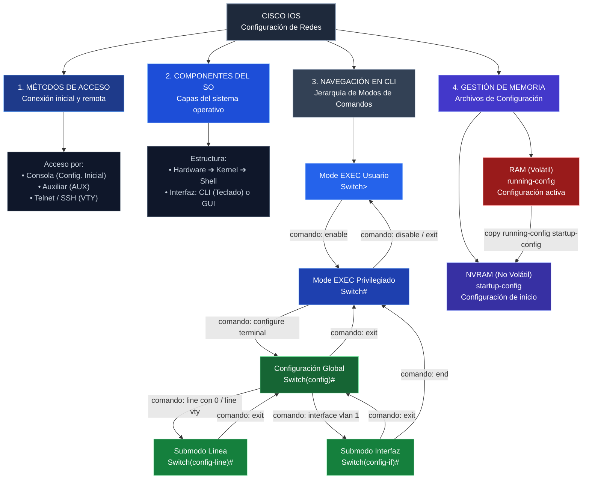
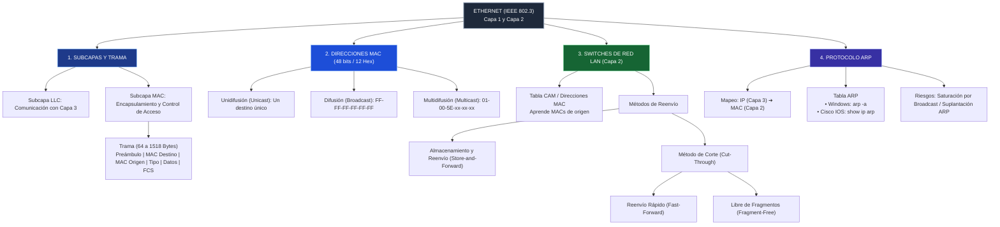
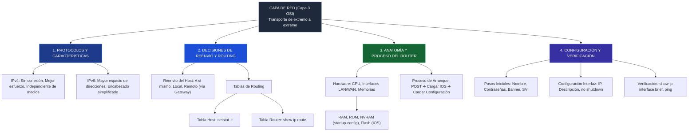
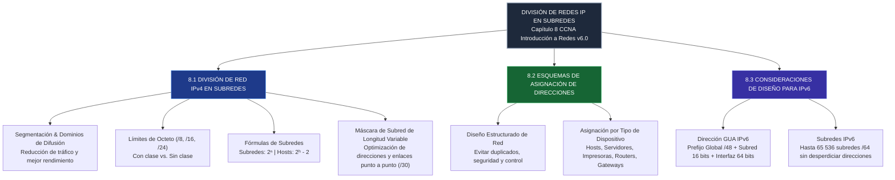
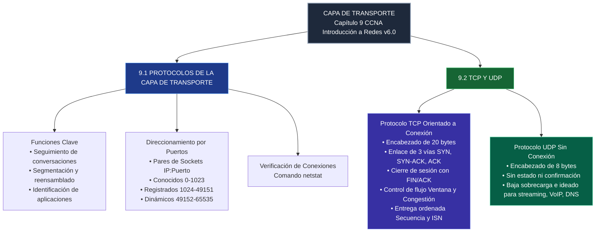
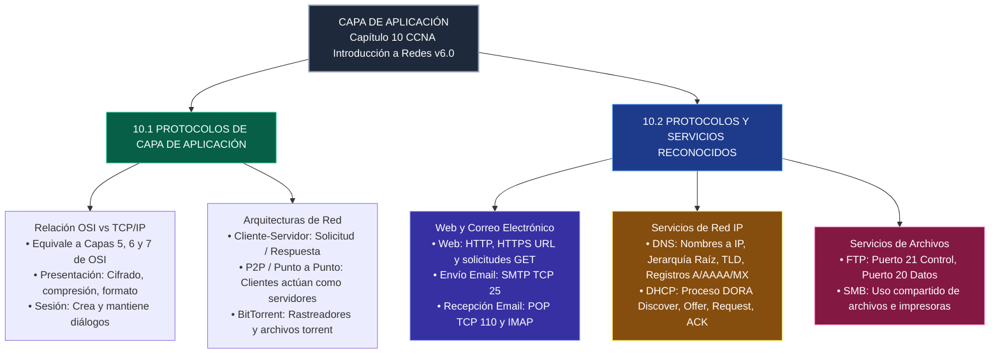

# Estructura en Cisco IOS

#### Comandos de Configuración Inicial y Seguridad

|**Área**|**Comando IOS**|**Función PDF**|
|---|---|---|
|**Nombre de Host**|`hostname [nombre]`|Asigna un identificador al dispositivo (debe iniciar con letra, sin espacios, <64 caracteres).|
|**Cifrado de Claves**|`service password-encryption`|Cifra todas las contraseñas guardadas en texto plano en el archivo de configuración.|
|**Aviso Legal**|`banner motd #[mensaje]#`|Muestra un mensaje de advertencia legal antes del inicio de sesión (evitar palabras de bienvenida).|
#### Gestión de Archivos de Configuración y Memoria

#### Gestión de Archivos de Configuración y Memoria

|**Archivo / Memoria**|**Tipo de Memoria**|**Volátil**|**Descripción PDF**|**Comando de Comprobación / Copia PDF**|
|---|---|---|---|---|
|**Running-config**|RAM|**Sí**|Configuración activa. Se modifica inmediatamente en operación.|`show running-config`|
|**Startup-config**|NVRAM|**No**|Configuración de inicio. Se carga al reiniciar o encender el dispositivo.|`copy running-config startup-config`|

#### Esquema de Direccionamiento IP y Verificación de Red

| **Elemento / Protocolo** | **Parámetros / Comandos**                                     | **Descripción / Uso PDF**                                                          |
| ------------------------ | ------------------------------------------------------------- | ---------------------------------------------------------------------------------- |
| **Estructura IPv4**      | Formato decimal punteado (ej. `192.168.1.10 / 255.255.255.0`) | Dirección única de 32 bits requerida para comunicación en red.                     |
| **DHCP**                 | Automático                                                    | Asigna IP, máscara y puerta de enlace dinámicamente a los hosts.                   |
| **Interfaz SVI**         | `interface vlan 1` `ip address [IP] [Máscara]`                | Interfaz virtual de switch empleada para la administración remota del equipo.      |
| **Verificación IP**      | `show ip interface brief`                                     | Muestra el estado operativo (`up/up`) y direcciones IP asignadas a las interfaces. |
| **Prueba Conectividad**  | `ping [IP / Dominio]`                                         | Envía paquetes ICMP para verificar la conectividad de extremo a extremo.           |

# Protocolo Ethernet

> [!important] Requisitos de tamaño de trama Ethernet
> - **Límite mínimo:** 64 bytes.
> - **Límite máximo:** 1518 bytes.
> - **Tramas menores a 64 bytes:** se consideran *runt frames* (tramas enanas), generalmente asociadas con colisiones o transmisiones incompletas, y son descartadas.
> - **Tramas mayores a 1518 bytes:** se consideran tramas excesivamente grandes; dependiendo del estándar y configuración de la red, pueden ser descartadas.

#### 1. Tipos de Direccionamiento en la Capa de Enlace (MAC)

| **Tipo de Dirección**         | **Formato / Valor de Destino**                         | **Descripción y Uso Principal**                                                                                |
| ----------------------------- | ------------------------------------------------------ | -------------------------------------------------------------------------------------------------------------- |
| **Unidifusión (Unicast)**     | Dirección MAC física específica de un host.            | Envío de datos desde un único emisor hacia un único receptor. La dirección de origen siempre debe ser unicast. |
| **Difusión (Broadcast)**      | `FF-FF-FF-FF-FF-FF` (48 unos en binario).              | Envío masivo a todos los dispositivos dentro del mismo segmento de red local.                                  |
| **Multidifusión (Multicast)** | Inicia obligatoriamente con `01-00-5E` en hexadecimal. | Envío a un grupo específico de dispositivos suscriptos dentro del segmento.                                    |

#### 2. Métodos de Reenvío de Tramas en Switches Cisco

| **Método de Reenvío**                              | **Funcionamiento Técnico**                                                                    | **Ventajas y Características**                                                   |
| -------------------------------------------------- | --------------------------------------------------------------------------------------------- | -------------------------------------------------------------------------------- |
| **Store-and-Forward** _(Almacenamiento y Reenvío)_ | Recibe la trama completa, verifica el campo FCS (verificación de errores) y luego la reenvía. | Garantiza que no se reenvíen tramas corruptas con errores.                       |
| **Cut-Through** _(Fast-Forward)_                   | Lee únicamente la dirección MAC de destino e inicia el reenvío de inmediato.                  | Ofrece el nivel de latencia más bajo en la red.                                  |
| **Cut-Through** _(Fragment-Free)_                  | Lee y almacena los primeros 64 bytes de la trama antes de reenviar.                           | Filtra la mayoría de los errores y colisiones sin sacrificar excesiva velocidad. |
###  Funcionamiento de la Tabla MAC / CAM en Switches

- **Naturaleza del Dispositivo:** El switch es un dispositivo de conmutación que opera en la Capa 2 (Enlace de Datos) del modelo OSI.
    
- **Proceso de Aprendizaje:** Construye dinámicamente la tabla de memoria de contenido direccionable (CAM) inspeccionando la dirección MAC de **origen** de cada trama que ingresa por sus puertos.
    
- **Reenvío y Filtrado de Tramas:**
    
    - **Destino Conocido:** Si la dirección MAC de **destino** está registrada en la tabla CAM, el switch envía la trama únicamente por el puerto asignado (filtrado).
        
    - **Inundación (Flooding):** Si la MAC de destino no se encuentra en la tabla, el switch transmite una unidifusión desconocida a todos los puertos activos con excepción del puerto de entrada.
        

###  Protocolo ARP (Address Resolution Protocol)

- **Función Principal:** Mapea y resuelve direcciones lógicas IPv4 (Capa 3) a direcciones físicas MAC (Capa 2) para permitir la entrega de paquetes dentro de la red local.
    
- **Tipos de Mensajes:**
    
    - **Solicitud ARP:** Se envía mediante difusión (_Broadcast_) a la dirección `FF-FF-FF-FF-FF-FF` cuando un dispositivo conoce la IP de destino pero desconoce su MAC.
        
    - **Respuesta ARP:** El dispositivo receptor que posee la IP consultada responde mediante un mensaje de unidifusión (_Unicast_).
        
- **Comandos de Consulta de Tabla ARP:**
    
    - **En Sistemas Windows:** Se consulta mediante el comando `arp -a`.
        
    - **En Cisco IOS:** Se visualiza mediante el comando `show ip arp`.
        

# La capa de red en las comunicaciones

### Tablas Informativas de Consulta Rápida

#### 1. Comparativa de Encabezados y Protocolos de la Capa de Red

| Característica / Campo              | Protocolo IPv4                                 | Protocolo IPv6                                    |
| ----------------------------------- | ---------------------------------------------- | ------------------------------------------------- |
| **Tamaño de Dirección**             | 32 bits.                                       | 128 bits.                                      |
| **Tamaño Base del Encabezado**      | 20 bytes.                                | 40 bytes (fijo y simplificado).             |
| **Límite de Vida del Paquete**      | Campo _Tiempo de duración_ (TTL).        | Campo _Límite de saltos_ (_Hop Limit_).     |
| **Prioridad / Calidad de Servicio** | _Servicios diferenciados_ (DS / DSCP).   | _Clase de tráfico_ (_Traffic Class_).       |
| **Identificación de Flujo**         | No disponible en encabezado base.           | Campo _Etiqueta de flujo_ (_Flow Label_).   |

#### 2. Tipos de Memorias en un Router Cisco y su Función

| Tipo de Memoria | Volatilidad        | Contenido Principal Almacenado                                                            |
| --------------- | ------------------ | ----------------------------------------------------------------------------------------- |
| **RAM (SDRAM)** | Volátil      | Configuración en ejecución (`running-config`), tablas de routing y búfer de paquetes.  |
| **Flash**       | No volátil   | Imagen del sistema operativo Cisco IOS y otros archivos del sistema.                |
| **NVRAM**       | No volátil   | Archivo de configuración de inicio (`startup-config`).                              |
| **ROM**         | No volátil   | Instrucciones de arranque, diagnóstico POST y software IOS simplificado.            |

### Conceptos 

> [!info] Funciones de la Capa de Red y Características de IP
> 
> - **Propósito:** Direccionamiento de terminales, encapsulamiento, routing y desencapsulamiento entre dispositivos de origen y destino.
>     
>     
>     
> - **Sin Conexión:** No establece un canal previo con el receptor antes de enviar los paquetes de datos.
>     
>     
>     
> - **Mejor Esfuerzo (Best Effort):** El protocolo IP no garantiza la entrega de los paquetes enviando información sin confirmación previa.
>     
>     
>     
> - **Independiente de los Medios:** Los paquetes pueden transitar por diferentes tipos de medios físicos (cobre, fibra óptica, inalámbrico).
>     
>     
>     

> [!example]  Decisiones de Reenvío y Tablas de Routing
> 
> - **Tipos de Destino:** Un host puede enviar paquetes a sí mismo (`127.0.0.1`), a un host local en la misma red o a un host remoto.
>     
>     
>     
> - **Gateway Predeterminado:** Dirección IP local del router que reenvía el tráfico hacia redes externas.
>     
>     
>     
> - **Comandos de Verificación:**
>     
>     - **Windows:** Comando `netstat -r` para desplegar la tabla de rutas del host.
>         
>         
>         
>     - **Cisco IOS:** Comando `show ip route` para visualizar la tabla de enrutamiento del router.
>         
>         
>         
> - **Códigos en Tabla del Router:** `C` indica red directamente conectada y `L` identifica la dirección IP local de la interfaz.
>     
>     
>     

# Asignación de Direcciones IP

```mermaid
flowchart TD
    %% Capa de Direccionamiento IP y Conectividad
    L3["ASIGNACIÓN DE DIRECCIONES IP<br/>Capítulo 7 CCNA Routing & Switching"] --> IPv4_SEC["1. DIRECCIONES DE RED IPv4"]
    L3 --> IPv6_SEC["2. DIRECCIONES DE RED IPv6"]
    L3 --> VERIF_SEC["3. VERIFICACIÓN DE CONECTIVIDAD"]

    %% Estructura e IPv4
    IPv4_SEC --> IPV4_STRUCT["Estructura: 32 bits en 4 octetos<br/>Conversión Binario ➔ Decimal"]
    IPv4_SEC --> IPV4_MASK["Máscara de Subred y Prefijo<br/>Operación AND Lógico"]
    IPv4_SEC --> IPV4_TYPES["Unidifusión, Difusión y Multidifusión"]
    IPv4_SEC --> IPV4_ADDR["Públicas, Privadas /8, /12, /16<br/>Especiales: Loopback, APIPA, TEST-NET"]

    %% Estructura e IPv6
    IPv6_SEC --> IPV6_NEED["Agotamiento IPv4 y Coexistencia<br/>Doble pila, Tunelización, NAT64"]
    IPv6_SEC --> IPV6_STRUCT["128 bits Hexadecimales<br/>Reglas de omisión de ceros"]
    IPv6_SEC --> IPV6_TYPES["Unidifusión Global, Link-Local,<br/>Local Única, Multidifusión"]
    IPv6_SEC --> IPV6_CONF["Configuración Estática y Dinámica<br/>SLAAC, DHCPv6"]

    %% ICMP y Pruebas
    VERIF_SEC --> ICMP["ICMPv4 e ICMPv6<br/>Mensajes RS, RA, NS, NA, DAD"]
    VERIF_SEC --> TOOLS["Pruebas con Ping y Traceroute<br/>Loopback, LAN, Red Remota, TTL"]

    style L3 fill:#1e293b,stroke:#94a3b8,stroke-width:2px,color:#fff
    style IPv4_SEC fill:#1e3a8a,stroke:#60a5fa,color:#fff
    style IPv6_SEC fill:#166534,stroke:#86efac,color:#fff
    style VERIF_SEC fill:#3730a3,stroke:#a5b4fc,color:#fff
```

### Tablas Informativas de Consulta Rápida

#### Comparativa de Direcciones IPv4 e IPv6

| Característica / Propiedad      | Protocolo IPv4                                       | Protocolo IPv6                                                    |
| ------------------------------- | ---------------------------------------------------- | ----------------------------------------------------------------- |
| **Longitud y Formato**          | 32 bits divididos en 4 octetos decimales.         | 128 bits organizados en 8 hextetos hexadecimales.                 |
| **Tipos de Tráfico**            | Unidifusión, Difusión (_Broadcast_) y Multidifusión. | Unidifusión, Multidifusión y Difusión por proximidad (_Anycast_). |
| **Coexistencia / Transición**   | N/A                                                  | Doble pila, Tunelización y Traducción (NAT64).                    |
| **Asignación Automática Local** | APIPA (`169.254.0.0/16`).                            | Direcciones Link-Local creadas autónomamente por el host.         |
| **Mecanismos Dinámicos**        | Servidor DHCP.                                       | SLAAC y DHCPv6.                                                   |

#### Rangos de Direcciones IPv4 Privadas y Especiales

|Tipo / Propósito|Rango CIDR / Prefijo|Rango de Direcciones IP|
|---|---|---|
|**Privada Clase A**|`10.0.0.0/8`|`10.0.0.0` a `10.255.255.255`|
|**Privada Clase B**|`172.16.0.0/12`|`172.16.0.0` a `172.31.255.255`|
|**Privada Clase C**|`192.168.0.0/16`|`192.168.0.0` a `192.168.255.255`|
|**Loopback**|`127.0.0.0/8`|`127.0.0.1` a `127.255.255.254`|
|**APIPA (Link-Local)**|`169.254.0.0/16`|`169.254.0.1` a `169.254.255.254`|
|**TEST-NET**|`192.0.2.0/24`|`192.0.2.0` a `192.0.2.255`|

### Módulos Informativos de Conceptos Clave

> [!info] 1. Estructura y Tipos de Comunicación en IPv4
> 
> - **Estructura:** Formada por 32 bits divididos en porción de red y porción de host según la máscara de subred o prefijo.
>     
>     
>     
> - **Operación AND:** Proceso matemático lógico entre la dirección IP y la máscara para determinar la dirección de red.
>     
> - **Unidifusión (Unicast):** Envío de paquetes individualmente desde un host origen hacia un único host destino.
>     
> - **Difusión (Broadcast):** Envío de información desde un host hacia todos los dispositivos presentes en la red.
>     
> - **Multidifusión (Multicast):** Transmisión dirigida a un grupo específico de hosts suscritos.
>     

> [!example] 2. Direccionamiento IPv6: Estructura y Simplificación
> 
> - **Estructura:** Consta de 128 bits con un prefijo de red (típicamente `/64`) y un ID de interfaz.
>     
> - **Reglas de Compresión:**
>     
>     - **Ceros iniciales:** Se pueden omitir los ceros a la izquierda en cualquier segmento hexadecimal.
>         
>     - **Doble dos puntos (`::`):** Reemplaza una secuencia continua de uno o más segmentos compuestos únicamente de ceros (solo una vez por dirección).
>         
> - **Unidifusión Global (GUA):** Direcciones únicas y enrutables en Internet compuestas por un prefijo de routing global, ID de subred e ID de interfaz.
>     
> - **Link-Local:** Utilizadas para comunicarse con dispositivos en el mismo enlace local sin necesidad de enrutamiento.
>     

> [!abstract] 3. Mensajería ICMP y Protocolos de Descubrimiento
> 
> - **ICMPv4 e ICMPv6:** Informan la entrega de paquetes, confirmación de host, destino inalcanzable y tiempo superado.
>     
> - **Mensajes Router ICMPv6:**
>     
>     - **RS (Router Solicitation):** El dispositivo solicita parámetros de red a los routers presentes.
>         
>     - **RA (Router Advertisement):** El router anuncia prefijos y configuraciones a los hosts.
>         
> - **Mensajes Vecinos ICMPv6:**
>     
>     - **NS / NA (Neighbor Solicitation / Advertisement):** Intercambio entre dispositivos para resolución de direcciones y detección de direcciones duplicadas (DAD).
>         

# División de redes 

#### Fórmulas y Cálculos de Subredes IPv4

|**Parámetro / Concepto**|**Fórmula / Regla**|**Descripción**|
|---|---|---|
|**Cantidad de Subredes**|$2^n$|$n$ = Bits tomados prestados de la porción de host.|
|**Hosts Utiles por Subred**|$2^h - 2$|$h$ = Bits restantes para la porción de host ($2$ se descuentan por red y _broadcast_).|
|**Subred con VLSM para Enlaces**|Prefijo `/30` (`255.255.255.252`)|Proporciona exactamente 2 direcciones de host útiles, ideal para enlaces serie.|
#### Ejemplos de División en Subredes según Prefijo

|**Prefijo Base**|**Nuevo Prefijo**|**Subredes Creadas**|**Hosts Útiles por Subred**|**Aplicación Típica**|
|---|---|---|---|---|
|`/24`|`/25`|2|126|Segmentación básica de una LAN pequeña.|
|`/24`|`/26`|4|62|División en 4 departamentos o áreas.|
|`/24`|`/27`|8|30|Cumplir requisitos de hasta 7 departamentos (máx. 29 hosts).|
|`/16`|`/18`|4|16 382|Subredes de gran tamaño corporativo.|
|`/16`|`/23`|128|510|Redes medianas con alta densidad de subredes.|
###  Conceptos 

> [!info] 1. Segmentación de Red y Dominios de Difusión
> 
> - **Dominios de Difusión:** Cada interfaz de un router delimita un dominio de difusión distinto.
>     
> - **Problemas de Redes Grandes:** Exceso de tráfico de difusión que degrada el rendimiento de la red y ralentiza los dispositivos procesando cada paquete.
>     
> - **Solución:** La división en subredes permite crear dominios de difusión más pequeños reduciendo el impacto del tráfico redundante.
>     

> [!example] 2. Máscara de Subred de Longitud Variable (VLSM)
> 
> - **Desperdicio en Subredes Tradicionales:** Aplicar una máscara fija a todas las subredes desperdicia direcciones IP en enlaces punto a punto o redes pequeñas.
>     
> - **Beneficio de VLSM:** Permite aplicar máscaras personalizadas según el tamaño real de cada segmento de red.
>     
> - **Uso en Enlaces Serie:** Asignar un prefijo `/30` deja solo 2 direcciones para hosts (RouterA y RouterB), optimizando la asignación.
>     

> [!tip] 4. Consideraciones de Diseño para IPv6
> 
> - **Estructura GUA:** Compuesta por un prefijo de enrutamiento global (típicamente `/48`), un ID de subred de 16 bits y una ID de interfaz de 64 bits.
>     
> - **Capacidad de Subredes:** La porción de ID de subred de 16 bits permite crear hasta 65 536 subredes `/64` independientes.
>     
> - **Diseño Simplificado:** A diferencia de IPv4, el agotamiento no es un problema en IPv6, por lo que el diseño se enfoca en una asignación lógica jerárquica en lugar del ahorro de direcciones.

# Capa de Transmisión  

#### Comparativa entre TCP y UDP

|**Característica / Propiedad**|**Protocolo TCP (Transmission Control Protocol)**|**Protocolo UDP (User Datagram Protocol)**|
|---|---|---|
|**Tipo de Conexión**|Orientado a conexión (establece sesión previa).|Sin conexión (envía datagramas directamente).|
|**Sobrecarga de Encabezado**|20 bytes de sobrecarga.|8 bytes de sobrecarga.|
|**Manejo de Estado**|Con información de estado (_Stateful_).|Sin información de estado (_Stateless_).|
|**Fiabilidad y Confirmación**|Alta: Números de secuencia, confirmaciones (ACK) y retransmisión.|Sin confirmación ni retransmisión integrada.|
|**Control de Flujo y Congestión**|Sí (mediante el tamaño de ventana y ajuste de bytes enviables).|No existe a nivel de transporte.|
|**Casos de Uso Ideales**|Navegación Web (HTTP/HTTPS), Correo (SMTP/POP3), Bases de Datos.|VoIP, Transmisión de vídeo en vivo, DNS, DHCP, TFTP.|

#### 2. Clasificación de Grupos de Puertos (IANA)

|**Grupo de Puertos**|**Rango de Valores**|**Propósito / Ejemplo de Uso**|
|---|---|---|
|**Puertos Conocidos** (_Well-Known_)|`0` a `1023`|Reservados para servicios de red estándar (Ej. HTTP: 80, POP3: 110).|
|**Puertos Registrados**|`1024` a `49151`|Asignados por la IANA a aplicaciones de usuario específicas.|
|**Puertos Privados o Dinámicos**|`49152` a `65535`|Asignados dinámicamente por el S.O. cliente al iniciar una comunicación.|

### Conceptos 

> [!info] 1. Funciones de la Capa de Transporte y Sockets
> 
> - **Funciones Principales:** Seguimiento de conversaciones individuales, segmentación de datos, reensamblado en el destino e identificación de la aplicación adecuada.
>     
> - **Multiplexión:** Permite que múltiples aplicaciones transmitan datos simultáneamente etiquetando cada fragmento mediante números de puerto.
>     
> - **Sockets:** Combinación de una dirección IP y un número de puerto (ejemplo: `192.168.1.5:1099`). Un par de sockets (origen-destino) identifica de manera única una conexión de red activa.
>     
> - **Verificación (`netstat`):** Comando ejecutable en cliente/servidor para inspeccionar las conexiones TCP/UDP activas y sus puertos.
>     

> [!example] 2. Funcionamiento del Protocolo TCP
> 
> - **Enlace de Tres Vías (_Three-Way Handshake_):**
>     
>     1. El cliente envía un segmento **SYN** para iniciar la comunicación.
>         
>     2. El servidor responde con **SYN-ACK** reconociendo la solicitud y pidiendo sesión inversa.
>         
>     3. El cliente responde con un **ACK** confirmando el establecimiento del enlace.
>         
> - **Terminación de Sesión:** Utiliza la bandera **FIN** acompañada de confirmaciones **ACK** en ambas direcciones para cerrar la conexión de forma ordenada.
>     
> - **Entrega Ordenada:** Cada segmento incluye un número de secuencia inicial (ISN) que se incrementa por byte enviado, lo que permite reordenar segmentos fuera de tiempo.
>     
> - **Control de Flujo:** El campo _Tamaño de Ventana_ define cuántos bytes puede procesar el receptor antes de exigir un acuse de recibo.
>     

> [!abstract] 3. Funcionamiento del Protocolo UDP
> 
> - **Baja Sobrecarga:** Al no mantener estado ni requerir confirmación, minimiza los retrasos de red.
>     
> - **Reorganización en Aplicación:** Si los datagramas llegan desordenados o se pierden, la responsabilidad del control recae sobre la capa de aplicación.
>     
> - **Inversión de Puertos:** Al responder, el servidor invierte el puerto de origen dinámico del cliente y lo usa como destino del datagrama.

# Capa  de Aplicación

#### Principales Protocolos de la Capa de Aplicación

|**Protocolo**|**Función Principal**|**Puerto(s) de Operación**|**Tipo de Servicio**|
|---|---|---|---|
|**HTTP / HTTPS**|Transferencia de páginas web y contenido multimedia.|TCP 80 / TCP 443.|Web / Cifrado web.|
|**SMTP**|Envío y retransmisión de mensajes de correo electrónico entre servidores.|TCP 25.|Correo Electrónico.|
|**POP3**|Descarga de correo desde el servidor al cliente (suele eliminar del servidor).|TCP 110.|Correo Electrónico.|
|**IMAP**|Visualización y sincronización de correo manteniendo copia en el servidor.|TCP 143 / TCP 993|Correo Electrónico.|
|**DNS**|Traducción dinámica de nombres de dominio (URL) a direcciones IP.|UDP/TCP 53.|Asignación de Direcciones.|
|**DHCP / DHCPv6**|Asignación automatizada de IP, máscara, gateway y DNS a hosts.|UDP 67 (Servidor) / UDP 68 (Cliente).|Configuración de Host.|
|**FTP**|Transferencia confiable de archivos entre cliente y servidor.|TCP 21 (Control) / TCP 20 (Datos).|Transferencia de Archivos.|
|**SMB**|Intercambio de recursos (archivos e impresoras) en redes locales.|TCP 445.|Compartir Recursos.|

#### Comparativa entre Modelos de Arquitectura (Cliente-Servidor vs. P2P)

|**Característica**|**Modelo Cliente-Servidor**|**Redes Punto a Punto (P2P)**|
|---|---|---|
|**Estructura**|Servidor centralizado atendiendo a múltiples clientes.|Descentralizado; cada punto (_peer_) actúa como cliente y servidor.|
|**Ubicación de Datos**|Almacenados en servidores dedicados.|Distribuidos entre los hosts conectados.|
|**Escalabilidad**|Limitada por la capacidad técnica del servidor central.|Alta; cada nuevo nodo aporta ancho de banda y recursos.|
|**Ejemplos**|Servidores Web (HTTP), Servidores de Correo (SMTP/POP).|BitTorrent, eDonkey, G2.|

> [!example]  Servicios de Red Esenciales (DNS y DHCP)
> 
> - **Estructura Jerárquica DNS:** Compuesta por servidores Raíz, dominios de nivel superior (TLD como `.com`, `.org`, `.co`) y dominios de nivel secundario.
>     
> - **Registros DNS Comunes:**
>     
>     - **A:** Mapea un nombre de host a una dirección IPv4.
>         
>     - **AAAA:** Mapea un nombre de host a una dirección IPv6.
>         
>     - **MX:** Identifica los servidores de correo electrónico para el dominio.
>         
>     - **NS:** Especifica los servidores de nombres autoritativos.
>         
> - **Proceso DORA de DHCP:**
>     
>     1. **D**iscover: El cliente transmite un mensaje en búsqueda de un servidor DHCP.
>         
>     2. **O**ffer: El servidor responde ofreciendo una dirección IP y parámetros de red.
>         
>     3. **R**equest: El cliente solicita formalmente el arrendamiento de los datos ofrecidos.
>         
>     4. **A**CK: El servidor confirma la concesión mediante un acuse de recibo.
>         

> [!abstract] Transferencia de Archivos y Correo Electrónico
> 
> - **Mecanismo Dual de FTP:** Utiliza dos conexiones independientes; la **conexión de control** en el puerto TCP 21 para enviar comandos, y la **conexión de datos** en el puerto TCP 20 para la transferencia de archivos.
>     
> - **Flujo de Correo Electrónico:** Un emisor envía un correo mediante **SMTP** a su servidor local, este lo retransmite vía **SMTP** al servidor de destino, y el receptor lo consulta o descarga empleando **POP3** o **IMAP**.

