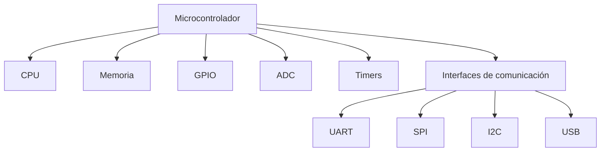
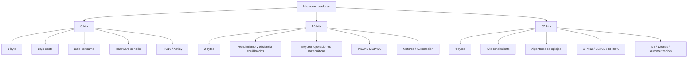

# Microcontroladores

## 1. Introducción a los microcontroladores

Un **microcontrolador (MCU)** es un circuito integrado programable que contiene los componentes esenciales de una computadora dentro de un solo circuito integrado.

Está diseñado principalmente para realizar tareas de control en **sistemas embebidos**.

### Características principales

- Integra CPU, memoria y periféricos.
- Es programable.
- Está diseñado para tareas específicas de control.
- Tiene bajo costo.
- Tiene bajo consumo de energía.
- Tiene un tamaño reducido.

---

## 2. Componentes principales de un microcontrolador

Un microcontrolador integra principalmente:

| Componente | Función |
|---|---|
| **CPU** | Ejecuta las instrucciones y procesa los datos. |
| **Memoria** | Almacena programas y datos temporales. |
| **GPIO** | Permiten entrada y salida de señales digitales. |
| **ADC** | Convierte señales analógicas en digitales. |
| **Timers** | Permiten medir tiempos y generar eventos. |
| **Interfaces de comunicación** | Permiten comunicarse con otros dispositivos. |

### Diagrama general

# 3. Microcontrolador vs computadora

Una diferencia importante es que el **microcontrolador integra CPU, memoria y periféricos en un solo circuito integrado**.

En una computadora convencional, la CPU puede requerir componentes externos para memoria y periféricos.

|Característica|Microcontrolador|PC|
|---|---|---|
|CPU|Integrada|Principalmente separada|
|Memoria|Integrada|Generalmente externa|
|Periféricos|Integrados|Muchos externos|
|Consumo|Bajo|Mayor|
|Tamaño|Reducido|Mayor|
|Uso|Control embebido|Propósito general|

---

# 4. Microcontrolador como SoC

Un microcontrolador puede considerarse un sistema integrado en un circuito, optimizado para:

- Bajo costo.
- Bajo consumo de energía.
- Tamaño reducido.
- Control de sistemas embebidos.

---

# 5. Familias de microcontroladores

Existen diferentes familias de microcontroladores, cada una con su propia arquitectura y ecosistema de desarrollo.

|Familia|Características|Ejemplos / Uso|
|---|---|---|
|**PIC**|Clásicos, robustos y de bajo costo|PIC16, PIC18|
|**AVR**|Arquitectura RISC de 8 bits|ATmega328P, Arduino|
|**ARM Cortex-M**|32 bits, alto rendimiento|STM32, LPC, Kinetis|
|**ESP**|32 bits, Wi-Fi y Bluetooth|ESP8266, ESP32|
|**MSP430**|Ultra bajo consumo|Texas Instruments|
|**RISC-V**|ISA de código abierto|Diversos fabricantes|

---

# 6. Familia AVR

Los AVR utilizan una arquitectura **RISC de 8 bits**.

### Características

- Eficientes.
- Bajo consumo.
- Fáciles de programar.
- Muy utilizados en prototipos.
- Base de la plataforma Arduino.

### Ejemplo importante

**ATmega328P**

Es utilizado en el **Arduino Uno**.

---

# 7. ARM Cortex-M

Los microcontroladores basados en ARM Cortex-M son muy utilizados en la industria.

### Características

- Arquitectura de 32 bits.
- Buen rendimiento.
- Bajo consumo.
- Gran cantidad de periféricos.
- Adecuados para sistemas embebidos avanzados.

### Ejemplos

- STM32
- NXP Kinetis
- LPC

---

# 8. ESP

Los microcontroladores ESP son muy utilizados en **IoT (Internet de las Cosas)**.

### Ejemplos

- ESP8266
- ESP32
- ESP32-S
- ESP32-C
- ESP32-H

### Características

- 32 bits.
- Wi-Fi integrado.
- Bluetooth en muchos modelos.
- Bajo costo.
- Muy utilizados en IoT.

---

# 9. MSP430

Los MSP430 son microcontroladores de **ultra bajo consumo**.

Son adecuados para:

- Dispositivos portátiles.
- Sensores.
- Sistemas alimentados con baterías.
- Aplicaciones donde se requiere gran duración de batería.

---

# 10. RISC-V

**RISC-V** es una arquitectura de conjunto de instrucciones (**ISA**) de código abierto.

Está ganando popularidad y existen diferentes familias de microcontroladores basadas en esta arquitectura.

---

# 11. Ancho de bus

El **ancho de bus** indica la cantidad de bits que el microcontrolador puede procesar o transferir en una operación.

El ancho del bus influye en:

- Rendimiento.
- Capacidad de procesamiento.
- Consumo.
- Costo.
- Complejidad.

## Clasificación

|Ancho|Procesamiento|Características|Ejemplos|
|---|---|---|---|
|**8 bits**|1 byte|Bajo costo y bajo consumo|PIC16, ATtiny|
|**16 bits**|2 bytes|Equilibrio entre rendimiento y consumo|PIC24, MSP430|
|**32 bits**|4 bytes|Alto rendimiento y mayor capacidad|STM32, ESP32|

---

# 12. Microcontroladores de 8 bits

Son los más pequeños y sencillos.

### Características

- Bus de datos de 8 bits.
- Procesan bloques de 1 byte.
- Bajo costo.
- Bajo consumo.
- Hardware sencillo.

### Usos

- Electrodomésticos.
- Sensores sencillos.
- Controles remotos.
- Juguetes.

### Ejemplos

- PIC16
- PIC18
- ATtiny

---

# 13. Microcontroladores de 16 bits

Representan un punto intermedio entre los microcontroladores de 8 y 32 bits.

### Características

- Procesan 2 bytes.
- Mejor rendimiento que los de 8 bits.
- Mejor manejo de operaciones matemáticas.
- Buena eficiencia energética.

### Usos

- Control de motores.
- Sistemas automotrices.
- Instrumentación.
- Dispositivos médicos portátiles.

### Ejemplos

- PIC24
- MSP430
- Infineon XC166

---

# 14. Microcontroladores de 32 bits

Son más potentes y complejos.

### Características

- Bus de datos de 32 bits.
- Procesan 4 bytes.
- Mayor capacidad de memoria.
- Mayor rendimiento.
- Pueden realizar operaciones matemáticas complejas.
- Pueden utilizar coma flotante por hardware.
- Pueden trabajar con RTOS.
- Permiten algoritmos complejos.

### Usos

- IoT avanzado.
- Robótica.
- Drones.
- Automatización industrial.
- Procesamiento de señales.
- Dispositivos con Wi-Fi/Bluetooth.

### Ejemplos

- ARM Cortex-M
- STM32
- ESP32
- RP2040

---

# 15. Comparación de 8, 16 y 32 bits

# 16. Bus de datos

El **bus de datos** es el camino por donde viajan los datos e instrucciones.

Su ancho determina cuánta información puede procesarse o transferirse simultáneamente.

Ejemplos:

- 8 bits → 8 bits por operación.
- 16 bits → 16 bits por operación.
- 32 bits → 32 bits por operación.

---

# 17. Bus de direcciones

El **bus de direcciones** determina la cantidad de memoria que el microcontrolador puede direccionar directamente.

La fórmula es:

2n2^n

Donde:

- `n` = número de bits del bus de direcciones.

### Ejemplos

|Bus de direcciones|Memoria direccionable|
|---|---|
|16 bits|64 KB|
|32 bits|4 GB|

### Ejemplo

Para 16 bits:

216=65,536 bytes=64 KB2^{16}=65,536\ bytes=64\ KB

Para 32 bits:

232=4,294,967,296 bytes=4 GB2^{32}=4,294,967,296\ bytes=4\ GB

---

# 18. Bus de control

El **bus de control** transporta señales utilizadas para coordinar y controlar las operaciones del microcontrolador.

Ejemplos:

- Lectura.
- Escritura.
- Reset.
- Interrupciones.
- Sincronización.

> Importante: el ancho del bus de control se refiere al número de líneas de control independientes, no a la cantidad de bits de datos.

---

# 19. Los tres buses principales

|Bus|Función principal|
|---|---|
|**Datos**|Transporta datos e instrucciones|
|**Direcciones**|Indica qué posición de memoria utilizar|
|**Control**|Coordina las operaciones|
# 20. Impacto del ancho del bus

## Rendimiento

Un bus más ancho permite procesar más datos por ciclo de reloj.

## Consumo

Los microcontroladores de 8 y 16 bits suelen presentar bajo consumo, especialmente en aplicaciones alimentadas por batería.

## Costo

Históricamente los microcontroladores de 8 bits eran considerablemente más baratos.

Actualmente los microcontroladores de 32 bits han reducido su costo y pueden resultar adecuados incluso para tareas sencillas.

## Programación

Los microcontroladores modernos pueden programarse utilizando lenguajes de alto nivel como:

- C++
- MicroPython

---

# 21. Memoria en microcontroladores

La memoria es fundamental porque determina:

- Qué tan complejo puede ser el programa.
- Cuántos datos pueden manejarse.
- Qué información puede conservarse después de apagar el dispositivo.

Los microcontroladores integran diferentes tipos de memoria.

---

# 22. Memoria Flash

La **memoria Flash** almacena principalmente:

- Código del programa.
- Firmware.
- Datos constantes.
- Tablas de búsqueda.
- Textos.

### Características

- No volátil.
- Conserva la información sin energía.
- Tiene ciclos de escritura limitados.
- Lectura rápida.
- Escritura más lenta que la lectura.

### Ejemplo

El **ATmega328P** utilizado en Arduino Uno tiene:

**32 KB de memoria Flash.**

---

# 23. Memoria RAM / SRAM

La **SRAM** almacena datos temporales durante la ejecución del programa.

Puede almacenar:

- Variables globales.
- Variables locales.
- Heap.
- Stack.
- Datos temporales.
- Información relacionada con funciones e interrupciones.

### Características

- Volátil.
- Pierde los datos cuando se corta la energía.
- Muy rápida.
- Permite lectura y escritura a velocidad del CPU.

### Ejemplo

El ATmega328P tiene:

**2 KB de SRAM.**

---

# 24. Memoria EEPROM

**EEPROM** significa:

> Electrically Erasable Programmable Read-Only Memory

Se utiliza para almacenar pequeños datos que deben permanecer después de apagar o reiniciar el microcontrolador.

### Ejemplos

- Configuraciones.
- Parámetros.
- Calibraciones.
- Contadores.
- Último estado del dispositivo.

### Características

- No volátil.
- Permite modificar datos por byte.
- Más lenta que Flash y RAM.

---

# 25. Comparación de memorias

|Memoria|Volátil|Uso principal|Velocidad|
|---|---|---|---|
|**Flash**|No|Programa/Firmware|Rápida|
|**SRAM**|Sí|Datos temporales|Muy rápida|
|**EEPROM**|No|Configuración/datos persistentes|Más lenta|

### Truco para memorizar

> **Flash = Programa**  
> **RAM = Trabajo temporal**  
> **EEPROM = Configuración permanente**

---

# 26. Arquitecturas de memoria

Dos arquitecturas importantes son:

- **Harvard**
- **Von Neumann**

### Arquitectura Harvard

Utiliza buses separados para:

- Instrucciones.
- Datos.

Esto permite que el ancho del bus de instrucciones sea diferente al ancho del bus de datos.

La arquitectura Harvard es común en algunos microcontroladores, como los PIC.

---

# 27. Timers

Los **Timers** son periféricos utilizados para trabajar con el tiempo y generar eventos.

Pueden utilizarse para:

- Medir intervalos.
- Generar eventos.
- Controlar procesos temporizados.
- Generar señales.

---

# 28. Interfaces de comunicación

Los microcontroladores pueden incorporar diferentes interfaces:

|Interfaz|Función general|
|---|---|
|**UART**|Comunicación serial|
|**SPI**|Comunicación serial de alta velocidad|
|**I2C**|Comunicación serial entre dispositivos|
|**USB**|Comunicación mediante USB|

---

# 29. Encoders y microcontroladores

Un punto importante:

> Un microcontrolador **NO es un encoder**.

El encoder es un sensor físico que detecta posición o movimiento.

El microcontrolador puede incorporar periféricos especializados para **leer y procesar las señales del encoder**.

---

# 30. Encoders incrementales

Los encoders incrementales pueden generar pulsos en:

- Canal A.
- Canal B.
- Canal Z, en algunos casos.

Los canales A y B permiten determinar:

- Cantidad de pulsos.
- Dirección del movimiento.

---

# 31. QEI / eQEP

Algunos microcontroladores incorporan periféricos especializados:

- **QEI** → Quadrature Encoder Interface.
- **eQEP** → Enhanced Quadrature Encoder Peripheral.

Estos periféricos permiten:

- Contar pulsos.
- Determinar dirección.
- Procesar señales del encoder.
- Reducir el trabajo de la CPU.

---

# 32. Microcontroladores para encoders

|Fabricante / Familia|Característica|
|---|---|
|**Texas Instruments C2000**|Control de motores industriales|
|**STM32**|Timers con modo Encoder|
|**Microchip dsPIC/PIC32**|Automatización y aplicaciones industriales|
|**ESP32**|Periférico PCNT para contar pulsos|

---

